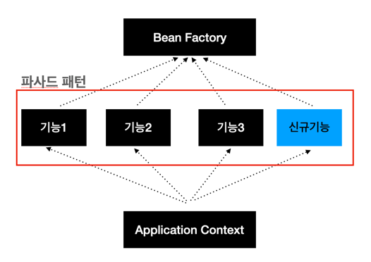
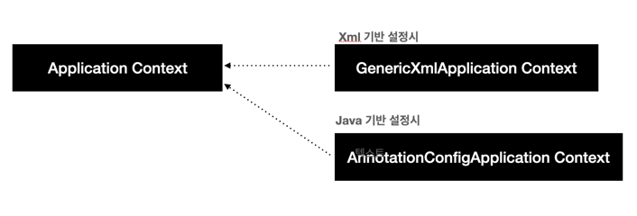
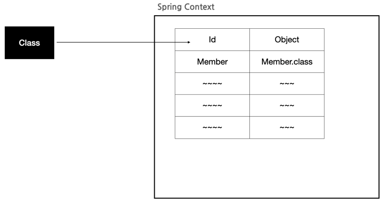

### 스프링 공부하기 1편

#### Baen Factory란
스프링 컨테이너의 최상위 컨테이너이며, ApplicationContext와 함께 스프링 컨테이너라고 불리우며 Bean의 생성과 설정, 관리등의 역할을 담당하고 있다.

여기서 <Strong>Bean</Strong>이란 스프링 컨테이너가 관리하는 모든 객체를 의미한다.

Spring 환경에서 Bean Factory의 기능을 상속받아 확장해 놓은 하위 인터페이스들이 존하게 되며
이러한 방식으로 생성된 여러가지 인터페이스를 한곳으로 모아 놓은 곳을 Application Context라고 한다.

#### Application Context란
Bean Factory의 후손으로 Bean Factory에 +@적인 기능을 모아놓은 Context이다.  
위와 같은 방식으로 서비스 객체를 구현하는 경우 Bean Factory를 상속받아 새로운 기능을 추가하는 경우
Application 코드를 직접 건들이지 않고 서비스의 기능을 추가하는 확장의 용의함을 갖고 있다.

아래의 그림은 Bean Factory와 Apllication Context의 관계를 도식화

또한, Bean Factory보다 많은 기능을 가지고 있는 Application Context는 하나의 인터페이스로 다음과 같은 방식을 이용하여 사용하게 된다.

### Spring Container
Spring Container은 다음과 같은 명칭으로 부르기도 한다.
1. Spring Container
2. Bean Factory
3. Application Context
4. Context
5. IOC Container
6. DI Container

Spring Container에서 Bean을 관리하는 방식은 Bean의 저장소를 만들고 다음과 같은 방식으로 관리한다.
 
이후 Bean의 ID를 이용하여 값을 꺼내오고 사용 하는 것이 가능하다.
